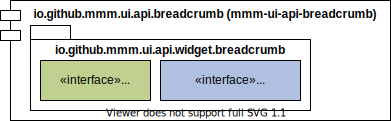

image:https://m-m-m.github.io/logo.svg[logo,width="150",link="https://m-m-m.github.io"]

image:https://img.shields.io/github/license/m-m-m/ui-api.svg?label=License["Apache License, Version 2.0",link=https://github.com/m-m-m/ui-api/blob/master/LICENSE]
image:https://github.com/m-m-m/ui-api/actions/workflows/build.yml/badge.svg["Build Status",link="https://github.com/m-m-m/ui-api/actions/workflows/build.yml"]

== mmm-ui-api-breadcrumb

image:https://img.shields.io/maven-central/v/io.github.m-m-m/mmm-ui-api-breadcrumb.svg?label=Maven%20Central["Maven Central",link=https://search.maven.org/search?q=g:io.github.m-m-m%20a:mmm-ui-api*]
image:https://javadoc.io/badge2/io.github.m-m-m/mmm-ui-api-breadcrumb/javadoc.svg["JavaDoc",link=https://javadoc.io/doc/io.github.m-m-m/mmm-ui-api-breadcrumb]

The module `mmm-ui-api-breadcrumb` provides support for a breadcrumb bar.
See the JavaDoc link for further details.

=== Usage

Maven Dependency:
```xml
<dependency>
  <groupId>io.github.m-m-m</groupId>
  <artifactId>mmm-ui-api-breadcrumb</artifactId>
</dependency>
```
Module Dependency:
```java
  requires transitive io.github.mmm.ui.api.breadcrumb;
```

=== Overview


