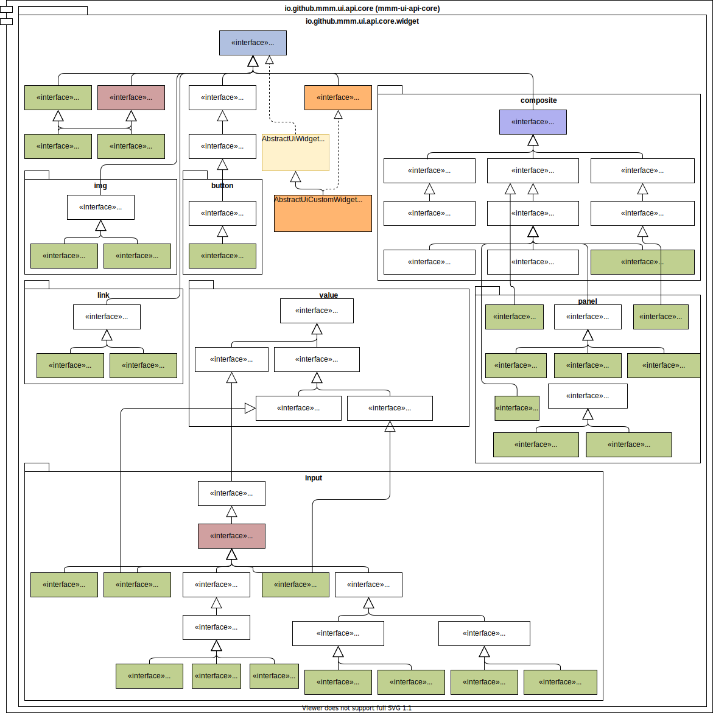

image:https://m-m-m.github.io/logo.svg[logo,width="150",link="https://m-m-m.github.io"]

image:https://img.shields.io/github/license/m-m-m/ui-api.svg?label=License["Apache License, Version 2.0",link=https://github.com/m-m-m/ui-api/blob/master/LICENSE]
image:https://travis-ci.com/m-m-m/ui-api.svg?branch=master["build-status",link="https://travis-ci.com/m-m-m/ui-api"]

== mmm-ui-api-core

image:https://img.shields.io/maven-central/v/io.github.m-m-m/mmm-ui-api-core.svg?label=Maven%20Central["Maven Central",link=https://search.maven.org/search?q=g:io.github.m-m-m]
image:https://javadoc.io/badge2/io.github.m-m-m/mmm-ui-api-core/javadoc.svg["base JavaDoc", link=https://javadoc.io/doc/io.github.m-m-m/mmm-ui-api-core]

The module `mmm-ui-api-core` is the core part of the UI API and will always be required. It contains central interfaces like `UiWidget`, `UiScreen`, `UiNotifier`, etc.
You will typically also need `mmm-ui-api-window` together with `mmm-ui-api-core` but all other API modules are optional.

=== Usage

Maven Dependency:
```xml
<dependency>
  <groupId>io.github.m-m-m</groupId>
  <artifactId>mmm-ui-api-core</artifactId>
</dependency>
```

Module Dependency:
```java
  requires transitive io.github.mmm.ui.api.core;
```

=== Overview


