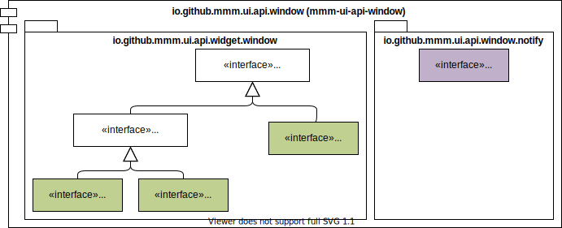
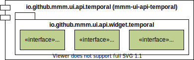
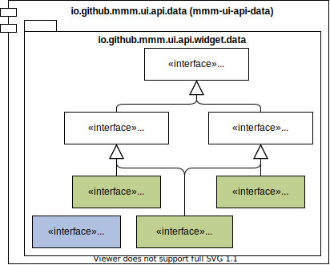
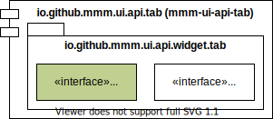
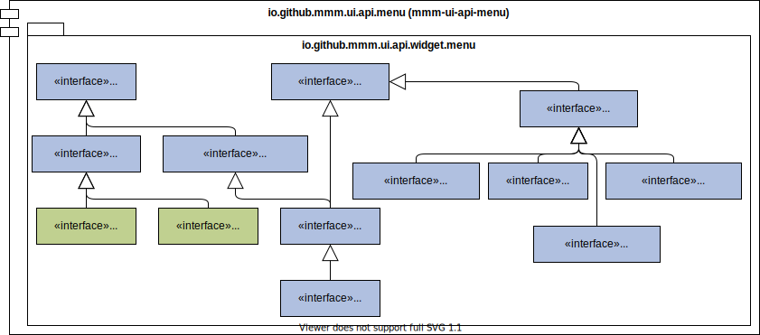
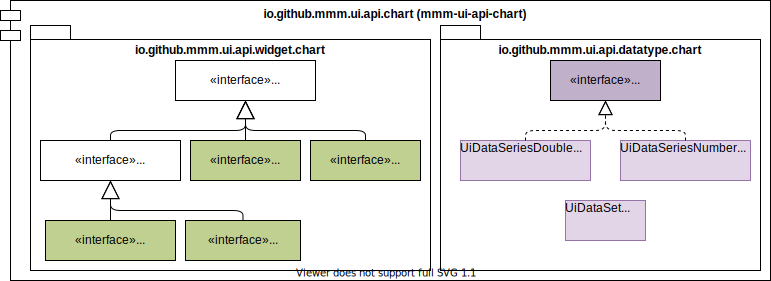
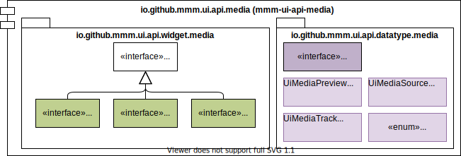

= documentation of mmm-ui-api

This `mmm-ui-api` provides a portable and toolkit-agnostic API to build user-interfaces (UIs).
It defines central interfaces like https://javadoc.io/doc/io.github.m-m-m/mmm-ui-api-core/latest/io.github.mmm.ui.api.core/io/github/mmm/ui/api/notify/UiNotifier.html[UiNotifier] or https://javadoc.io/doc/io.github.m-m-m/mmm-ui-api-core/latest/io.github.mmm.ui.api.core/io/github/mmm/ui/api/UiLocalizer.html[UiLocalizer] that provide functinal services for your UI.
Such interfaces therefore have a static `get` method that allows you to get access to the singleton instance.

== widgets

The heart of this API are the many widget interfaces starting with https://javadoc.io/doc/io.github.m-m-m/mmm-ui-api-core/latest/io.github.mmm.ui.api.core/io/github/mmm/ui/api/widget/UiWidget.html[UiWidget].
First, you should understand the following type of widgets:

* https://javadoc.io/doc/io.github.m-m-m/mmm-ui-api-core/latest/io.github.mmm.ui.api.core/io/github/mmm/ui/api/widget/UiNativeWidget.html[UiNativeWidget] is the super-interface of all _native_ widgets.
When programming with interfaces we need to know what interfaces are "instantiable" (non-abstract).
Therefore these widget interfaces extend https://javadoc.io/doc/io.github.m-m-m/mmm-ui-api-core/latest/io.github.mmm.ui.api.core/io/github/mmm/ui/api/widget/UiNativeWidget.html[UiNativeWidget].
As widgets are technically created via https://javadoc.io/doc/io.github.m-m-m/mmm-ui-api-core/latest/io.github.mmm.ui.api.core/io/github/mmm/ui/api/factory/UiWidgetFactoryNative.html[UiWidgetFactoryNative] and the `create` method only takes classes that extend https://javadoc.io/doc/io.github.m-m-m/mmm-ui-api-core/latest/io.github.mmm.ui.api.core/io/github/mmm/ui/api/widget/UiNativeWidget.html[UiNativeWidget], we even get type-safety and cannot create widgets from non-native interfaces.
However, all interfaces extending https://javadoc.io/doc/io.github.m-m-m/mmm-ui-api-core/latest/io.github.mmm.ui.api.core/io/github/mmm/ui/api/widget/UiNativeWidget.html[UiNativeWidget] will have one or multiple static `of` methods. These methods act as a "constructor" that allows you to easily instantiate the widget. In the below UML diagrams _native_ widgets are highlighted with green color.
* https://javadoc.io/doc/io.github.m-m-m/mmm-ui-api-core/latest/io.github.mmm.ui.api.core/io/github/mmm/ui/api/widget/UiRegularWidget.html[UiRegularWidget] is the super-interface of all _regular_ widgets.
A regular widget can be added as child widget to any normal panel or composite widget. This applies to most widgets but some like https://javadoc.io/doc/io.github.m-m-m/mmm-ui-api-menu/latest/io.github.mmm.ui.api.menu/io/github/mmm/ui/api/widget/menu/UiMenuBar.html[UiMenuBar], https://javadoc.io/doc/io.github.m-m-m/mmm-ui-api-tab/latest/io.github.mmm.ui.api.tab/io/github/mmm/ui/api/widget/tab/UiTab.html[UiTab], https://javadoc.io/doc/io.github.m-m-m/mmm-ui-api-data/latest/io.github.mmm.ui.api.data/io/github/mmm/ui/api/widget/data/UiColumn.html[UiColumn], etc. are not regular.
* https://javadoc.io/doc/io.github.m-m-m/mmm-ui-api-core/latest/io.github.mmm.ui.api.core/io/github/mmm/ui/api/widget/composite/UiComposite.html[UiComposite] is the super-interface of all _composite_ widgets.
A composite widget can contain one or typically multiple child widgets. Widgets extending https://javadoc.io/doc/io.github.m-m-m/mmm-ui-api-core/latest/io.github.mmm.ui.api.core/io/github/mmm/ui/api/widget/composite/UiMutableComposite.html[UiMutableComposite] are very flexible composite widgets and allow to dynamically add and remove any number of children.
Panels are composite widgets that are used as generic containers to layout their children in a specific way.
Most of them extend https://javadoc.io/doc/io.github.m-m-m/mmm-ui-api-core/latest/io.github.mmm.ui.api.core/io/github/mmm/ui/api/widget/panel/UiMutablePanel.html[UiMutablePanel].
* https://javadoc.io/doc/io.github.m-m-m/mmm-ui-api-window/latest/io.github.mmm.ui.api.window/io/github/mmm/ui/api/widget/window/UiAbstractWindow.html[UiAbstractWindow] is the super-interface of all _window_ widgets.
https://javadoc.io/doc/io.github.m-m-m/mmm-ui-api-window/latest/io.github.mmm.ui.api.window/io/github/mmm/ui/api/widget/window/UiMainWindow.html[UiMainWindow] is the main window of your client app.
If your client runs in the browser this will represent the browser window or more technically the document body.
You can create https://javadoc.io/static/io.github.m-m-m/mmm-ui-api-window/0.1.1/io.github.mmm.ui.api.window/io/github/mmm/ui/api/widget/window/UiWindow.html[UiWindow]s or modal https://javadoc.io/static/io.github.m-m-m/mmm-ui-api-window/0.1.1/io.github.mmm.ui.api.window/io/github/mmm/ui/api/widget/window/UiPopup.html[UiPopups] that can be opened and closed dynamically by your client app.
* https://javadoc.io/doc/io.github.m-m-m/mmm-ui-api-core/latest/io.github.mmm.ui.api.core/io/github/mmm/ui/api/widget/UiCustomWidget.html[UiCustomWidget] is the interface for _custom_ widgets.
https://javadoc.io/doc/io.github.m-m-m/mmm-ui-api-core/latest/io.github.mmm.ui.api.core/io/github/mmm/ui/api/widget/AbstractUiCustomWidget.html[AbstractUiCustomWidget] is an abstract class implementing this interface and is part of `mmm-ui-api`.
When you create your client from only interfaces it is kind of hard to build reusable units of your UI.
To make this API cool and fun to use, we introduce custom widgets that are implemented as regular Java classes and act as a delegate wrapping a native widget.
This allows you to create any kind of composite panel for your UI as a regular class that can be instantiated with a regular constructor and reused easily.
We already ship with abstract base classes for common panels and composite inputs.
* https://javadoc.io/doc/io.github.m-m-m/mmm-ui-api-core/latest/io.github.mmm.ui.api.core/io/github/mmm/ui/api/widget/input/UiInput.html[UiInput] is the super-interface of all _input_ widgets.
Such input widget is used to display and edit values.
There are native widget interfaces for all kind of inputs such as https://javadoc.io/doc/io.github.m-m-m/mmm-ui-api-core/latest/io.github.mmm.ui.api.core/io/github/mmm/ui/api/widget/input/UiTextInput.html[UiTextInput],
https://javadoc.io/doc/io.github.m-m-m/mmm-ui-api-core/latest/io.github.mmm.ui.api.core/io/github/mmm/ui/api/widget/input/UiTextArea.html[UiTextArea],
https://javadoc.io/doc/io.github.m-m-m/mmm-ui-api-core/latest/io.github.mmm.ui.api.core/io/github/mmm/ui/api/widget/input/UiRadioChoice.html[UiRadioChoice],
https://javadoc.io/doc/io.github.m-m-m/mmm-ui-api-core/latest/io.github.mmm.ui.api.core/io/github/mmm/ui/api/widget/input/UiComboBox.html[UiComboBox],
https://javadoc.io/doc/io.github.m-m-m/mmm-ui-api-temporal/latest/io.github.mmm.ui.api.temporal/io/github/mmm/ui/api/widget/temporal/UiDateTimeInput.html[UiDateTimeInput],
and whatever you need.
The smart thing is that each input widget has a `name` and https://javadoc.io/doc/io.github.m-m-m/mmm-ui-api-core/latest/io.github.mmm.ui.api.core/io/github/mmm/ui/api/widget/UiLabel.html[UiLabel] (lazily created) associated.
This makes it much simpler to create forms and gives you according accessibility ascpects automatically.
Further, input widgets extend from https://javadoc.io/doc/io.github.m-m-m/mmm-ui-api-core/latest/io.github.mmm.ui.api.core/io/github/mmm/ui/api/widget/value/UiValidatableWidget.html[UiValidatableWidget] what brings validation support and also comes with build-in dirty check and many other higher-level features.

== Controllers

TODO

== UML Diagrams

To quickly get an overview of the rich and therefore manybe complex `mmm-ui-api` we provide the following UML diagrams.
Important types are colored so you can easily find the more important things.

=== core

image:../src/main/javadoc/doc-files/ui-api-core.svg[logo,link="https://raw.githubusercontent.com/m-m-m/ui-api/master/src/main/javadoc/doc-files/ui-api-core.svg"]

=== window

=== number

image:../src/main/javadoc/doc-files/ui-api-number.svg[logo,link="https://raw.githubusercontent.com/m-m-m/ui-api/master/src/main/javadoc/doc-files/ui-api-number.svg"]

=== temporal

=== data

=== tab

=== menu

=== chart

=== breadcrumb

image:../src/main/javadoc/doc-files/ui-api-breadcrumb.svg[logo,link="https://raw.githubusercontent.com/m-m-m/ui-api/master/src/main/javadoc/doc-files/ui-api-breadcrumb.svg"]

=== media

=== form

image:../src/main/javadoc/doc-files/ui-api-form.svg[logo,link="https://raw.githubusercontent.com/m-m-m/ui-api/master/src/main/javadoc/doc-files/ui-api-form.svg"]

=== format

image:../src/main/javadoc/doc-files/ui-api-format.svg[logo,link="https://raw.githubusercontent.com/m-m-m/ui-api/master/src/main/javadoc/doc-files/ui-api-format.svg"]

=== controller

image:../src/main/javadoc/doc-files/ui-api-controller.svg[logo,link="https://raw.githubusercontent.com/m-m-m/ui-api/master/src/main/javadoc/doc-files/ui-api-controller.svg"]

=== binding

image:../src/main/javadoc/doc-files/ui-api-binding.svg[logo,link="https://raw.githubusercontent.com/m-m-m/ui-api/master/src/main/javadoc/doc-files/ui-api-binding.svg"]
