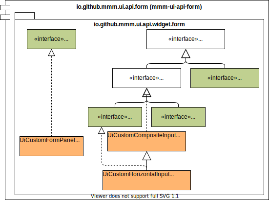

image:https://m-m-m.github.io/logo.svg[logo,width="150",link="https://m-m-m.github.io"]

image:https://img.shields.io/github/license/m-m-m/ui-api.svg?label=License["Apache License, Version 2.0",link=https://github.com/m-m-m/ui-api/blob/master/LICENSE]
image:https://travis-ci.com/m-m-m/ui-api.svg?branch=master["build-status",link="https://travis-ci.com/m-m-m/ui-api"]

== mmm-ui-api-form

image:https://img.shields.io/maven-central/v/io.github.m-m-m/mmm-ui-api-form.svg?label=Maven%20Central["Maven Central",link=https://search.maven.org/search?q=g:io.github.m-m-m]
image:https://javadoc.io/badge2/io.github.m-m-m/mmm-ui-api-form/javadoc.svg["base JavaDoc", link=https://javadoc.io/doc/io.github.m-m-m/mmm-ui-api-form]

The module `mmm-ui-api-form` provides composite widgets like `UiFormPanel` or `UiFormGroup` to build forms to edit data.
See the JavaDoc link for further details.

=== Usage

Maven Dependency:
```xml
<dependency>
  <groupId>io.github.m-m-m</groupId>
  <artifactId>mmm-ui-api-form</artifactId>
</dependency>
```
Module Dependency:
```java
  requires transitive io.github.mmm.ui.api.form;
```

=== Overview


